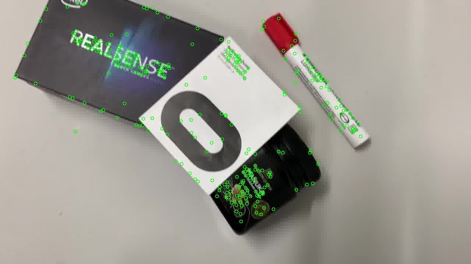
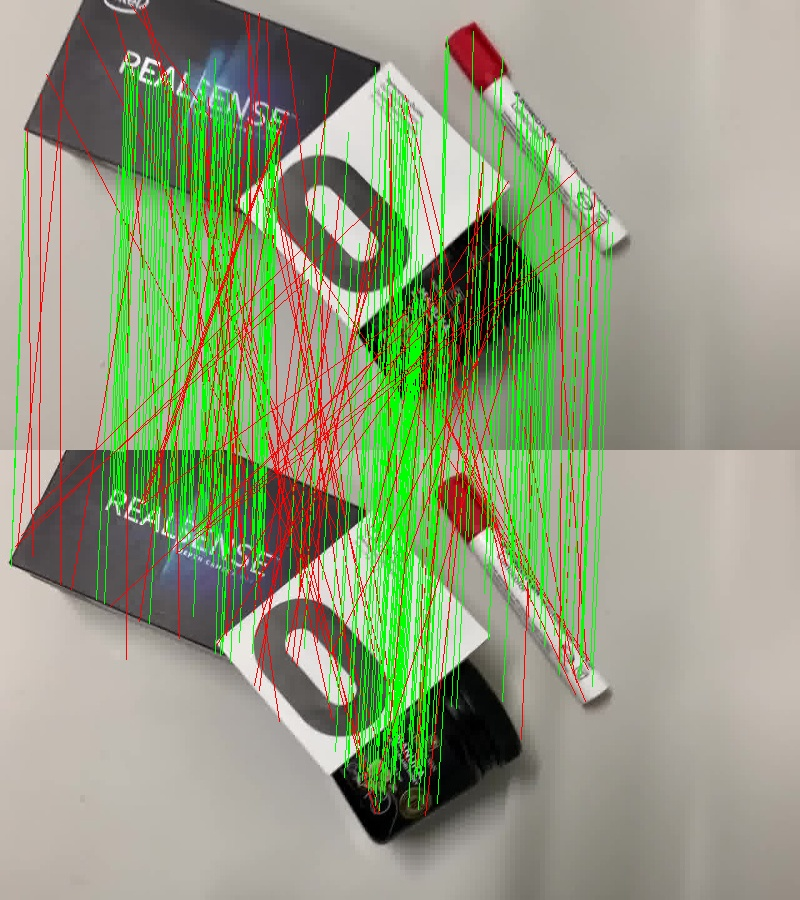

# Video Stabilizer

TODO: add CI badges

An application of Lowe's Scale-Invariant Feature Transform (SIFT)[^1] feature detection and Fischler and Bolles' RAndom SAmple Consesus (RANSAC)[^2] algorithm to compute robust estimate homography matrices to stabilize a video on a frame-by-frame basis.

[^1]: Lowe, David G. "Distinctive image features from scale-invariant keypoints." _International Journal of Computer Vision_, vol. 60, no. 2, 2004, pp. 91-110. [https://doi.org/10.1023/B:VISI.0000029664.99615.94](https://doi.org/10.1023/B:VISI.0000029664.99615.94)

[^2]: Fischler, Martin A., and Robert C. Bolles. "Random sample consensus: A paradigm for model fitting with applications to image analysis and automated cartography." _Communications of the ACM_, vol. 24, no. 6, 1981, pp. 381-395. [https://doi.org/10.1145/358669.358692](https://doi.org/10.1145/358669.358692).

## Example

| Original | Stabilized |
|:--------:|:----------:|
|  |  |

## How Does it Work?

When stabilizing a video, the goal is to remove unwanted camera motion (e.g. shaking or jittering) while preserving the intended motion (e.g. panning or zooming). The algorithm can be broken down in to these steps:

1. **Detect Key Points:** key points are detected in each video frame using feature detection techniques like SIFT, SURF, or ORB (in this project, we use SIFT). These are distinct points in the frame, like corners or edges, that are easy to track across frames.

  

2. **Match Key Points Across Frames:** The key points from one frame are matched to the corresponding points in the next frame. This matching allows us to estimate how the frame has shifted, rotated, or transformed.

  

3. **Estimate the Homography Matrix:** Using the matched key points and the RANSAC algorithm, a homography matrix (shortened to "H matrix") is computed for every pair of consecutive frames to model the transformation between them. This estimated transform matrix includes translations (i.e. how the camera moved), rotations (i.e. how the frame tilted), and other distortions like perspective shifts.
4. **Stabilization:** To stabilize the video, the calculated H matrix is applied to every pair of frames to correct the unwanted motion. If a frame shifted slightly, e.g. due to hand tremors, applying the h matrix would shift the frame back into alignment, as well as correcting rotation or perspective distortions.
5. **Apply Smoothing:** The calculated homographies can then be smoothed out over several frames to ensure the stabilization is gradual and not abrupt. This prevents a "jumping" effect in the video, leading to smoother output.
6. **Cropping**: During stabilization, the algorithm attempts to counteract shaky movements by shifting the frames accordingly. These shifts can create gaps or borders (show below in green) around the edges of the video. To avoid showing these unwanted borders, stabilized videos are slightly cropped—a small trade-off to hide the artifacts introduced.

  

## Building

### Prerequisites

To build this project, please ensure that your system has the following software already installed:

- [vcpkg](https://vcpkg.io/)
- [CMake](https://cmake.org/)
- [git](https://git-scm.com/)

## Future Improvements

- [ ] Loading and progress status indicators
- [ ] Preview of original video
- [ ] Preview of stabilized video
- [ ] Run stabilization in dedicated thread
- [ ] Custom file name for stabilized video
- [ ] Add support for logging
- [ ] Display video meta-data
- [ ] Support codecs for other platforms (currently only supports DIVX)
- [ ] Support multiple output formats
- [ ] Support running on MacOS and mainstream Linux distros
- [ ] Set up a vcpkg binary cache using [GitHub Actions Cache](https://learn.microsoft.com/en-us/vcpkg/consume/binary-caching-github-actions-cache)

## Attributions

The user interface was created using [ImGui](https://github.com/ocornut/imgui), and the stabilization algorithm was implemented using the [OpenCV library](https://opencv.org/).
